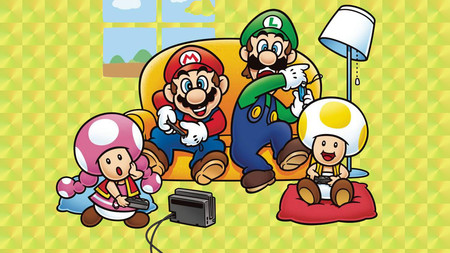

# Mi priemr proyecto:
# Indice:
1. Título del Juego
2. Indicación de las tecnologías empleadas 
3. Imágenes y vídeos
4. Motivación del proyecto
5. Estructura del proyecto
6. Acceso directo al juego
7. Tabla de contenidos o índice
8. Manual de instalación y deployment
9. Ejemplos de código
10. Entornos de ejecución
11. Variables globales
12. Listado de paquetes y dependencias
13. Estadísticas
14. Licencias
15. Agradecimientos
16. Otras consideraciones

## 1. Titulo del Juego: 
Mariana Sister

## 2. Indicación de las tecnologías empleadas:
## 3. Imágenes y vídeos:

## 4. Motivación del proyecto:
La motivación vienen dada del tradicional juego de Super Mario Bros,
siempre que he recordado un videojuego, me ha venido a la cabeza Mario Bross, he jugado bastante
de pequeña y me trae bastantes buenos recuerdos. Ver que es posible poder crearlo desde cero, para mi sería un gran reto.

Va a merecer la pena poder emplearle tiempo!!

## 5. Estructura del proyecto:
## 6. Acceso directo al juego:
* [Pincha aquí para poder acceder](http://localhost:1234)
## 7. Tabla de contenidos o índice:
* Personajes:
    * Mariana 
    * ...!!
## 8. Manual de instalación y deployment:
     
## 9. Ejemplos de código:
## 10. Entornos de ejecución:
## 11. Variables globales:

## 12. Listado de paquetes y dependencias:
* Node package manager: npm
* To run the HTML: parcel
* Language used typescript
* MDN [Api Canvas](https://developer.mozilla.org/es/docs/Web/API/Canvas_API)
* Css [Información sobre el Modelo de cajas Flexbox](https://css-tricks.com/snippets/css/a-guide-to-flexbox/)
    * Como aprender de manera divertida el modelo de cajas [Juego](https://flexboxfroggy.com/)
* [Pincha aquí para crear sprite personalizados](https://sanderfrenken.github.io/Universal-LPC-Spritesheet-Character-Generator/#?body=Humanlike_white)

## 13. Estadísticas:
## 14. Licencias
## 15. Agradecimientos:
## 16. Otras consideraciones:
