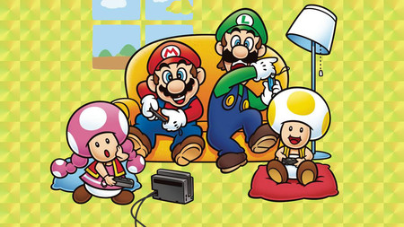

# Mi primer proyecto de [Core Code School](https://www.corecode.school/)
# Indice:
- [Mi primer proyecto de Core Code School](#mi-primer-proyecto-de-core-code-school)
- [Indice:](#indice)
  - [1. Título del Juego:](#1-título-del-juego)
  - [2. Indicación de las tecnologías empleadas:](#2-indicación-de-las-tecnologías-empleadas)
  - [3. Imágenes y vídeos:](#3-imágenes-y-vídeos)
  - [4. Motivación del proyecto:](#4-motivación-del-proyecto)
  - [5. Estructura del proyecto:](#5-estructura-del-proyecto)
  - [6. Acceso directo al juego:](#6-acceso-directo-al-juego)
  - [7. Tabla de contenidos o índice:](#7-tabla-de-contenidos-o-índice)
  - [8. Manual de instalación y deployment:](#8-manual-de-instalación-y-deployment)
  - [9. Ejemplos de código:](#9-ejemplos-de-código)
  - [10. Entornos de ejecución:](#10-entornos-de-ejecución)
  - [Variables globales:](#variables-globales)
  - [12. Listado de paquetes y dependencias:](#12-listado-de-paquetes-y-dependencias)
  - [13. Estadísticas:](#13-estadísticas)
  - [14. Licencias](#14-licencias)
  - [15. Agradecimientos:](#15-agradecimientos)
  - [16. Otras consideraciones:](#16-otras-consideraciones)
   
  - [7. Tabla de contenidos o índice:](#7-tabla-de-contenidos-o-índice)
  - [8. Manual de instalación y deployment:](#8-manual-de-instalación-y-deployment)
  - [9. Ejemplos de código:](#9-ejemplos-de-código)
  - [10. Entornos de ejecución:](#10-entornos-de-ejecución)
  - [11. Variables globales:](#11-variables-globales)
  - [12. Listado de paquetes y dependencias:](#12-listado-de-paquetes-y-dependencias)
  - [13. Estadísticas:](#13-estadísticas)
  - [14. Licencias](#14-licencias)
  - [15. Agradecimientos:](#15-agradecimientos)
  - [16. Otras consideraciones:](#16-otras-consideraciones)


## 1. Título del Juego:
Mariana Sister

## 2. Indicación de las tecnologías empleadas:

## 3. Imágenes y vídeos:

## 4. Motivación del proyecto:
La motivación vienen dada del tradicional juego de Super Mario Bros,
siempre que he recordado un videojuego, me ha venido a la cabeza Mario Bross, he jugado bastante
de pequeña y me trae bastantes buenos recuerdos. Ver que es posible poder crearlo desde cero, para mi sería un gran reto.

Va a merecer la pena poder emplearle tiempo!!

## 5. Estructura del proyecto:
## 6. Acceso directo al juego:
* [Pincha aquí para poder acceder](https://nadaronda.github.io/Mariana-sister/)
  
* El juego de Mariana Sister se basa en el juego de Super Mario Bros, los comandos son los siguientes:
  
     - La flecha de derecha es para desplazarnos a la derecha.
     - La flecha de izquierda es para desplazarnos a la izquierda.
     - La flecha de arriba es para subir escaleras,o levantar brazos.(falta por hacer)
     - La flecha de abajo baja escalera y se agacha(falta por hacer).
     - La barra de espacio se utiliza para saltar(En proceso).
     - El objetivo del juego es llegar a la meta antes de que termine el tiempo definido en la esquina superior dercha(falta por hacer), sin que le maten.
## 7. Tabla de contenidos o índice:
* Personajes:
    * Mariana 
    * ...??
## 8. Manual de instalación y deployment:
```
Clone the repository:
    git clone https://github.com/nadaronda/Mariana-sister

Initiate npm:
    npm init

Or use this instead:
    npm init -y

Install dependencies:
    npm install

Execute the project:
    npm run dev

``` 
## 9. Ejemplos de código:
## 10. Entornos de ejecución:
* [Visual Studio Code](https://code.visualstudio.com/Download)
## Variables globales:

## 12. Listado de paquetes y dependencias:
* Node package manager: [npm](https://www.npmjs.com/)
* To run the HTML: [parcel](https://www.npmjs.com/package/parcel ), [más información](https://parceljs.org/languages/javascript/#classic-scripts)
* Language used [typescript](https://www.npmjs.com/package/typescript)
*  [ts-node-dev](https://www.npmjs.com/package/ts-node-dev)
*  Lenguajes de programación:[typescript](https://www.npmjs.com/package/typescript)
* MDN [Api Canvas](https://developer.mozilla.org/es/docs/Web/API/Canvas_API)
* Css [Información sobre el Modelo de cajas Flexbox](https://css-tricks.com/snippets/css/a-guide-to-flexbox/)
    * Como aprender de manera divertida el modelo de cajas [Juego](https://flexboxfroggy.com/)
* [Pincha aquí para crear sprite personalizados](https://sanderfrenken.github.io/Universal-LPC-Spritesheet-Character-Generator/#?body=Humanlike_white)


## 13. Estadísticas:
## 14. Licencias
## 15. Agradecimientos:
## 16. Otras consideraciones:
